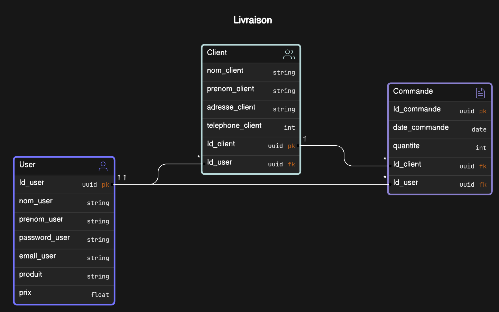

# LA7AGLI - Product Delivery Management System

LA7AGLI is a product delivery management system that helps you manage your product deliveries and clients. It is a web application that allows you to add, edit, and delete clients and deliveries. You can also view the list of deliveries and clients, and search for specific clients by name and for deliveries by date. The system is designed to be user-friendly and easy to use, with a simple and intuitive interface.

## Project overview

The project is divided into the following directories:

```
assets
controllers
model
public
|_ fonts
|  |_ SF-PRO
|_ images
|_ styles
views
```

Inside each directory there are corresponding files that contain the code for the project. The entry point is located at `landing.php` in the `views` directory.

## Features

- User registration and login.
- Add a new client to the system.
- Add a new delivery to the system.
- View all clients in the system.
- View all deliveries in the system.
- Search for a specific client by their first name or last name.
- Search for deliveries based on the delivery date.
- Update a client's information.
- Update a delivery's information.
- Delete a client from the system.
- Delete a delivery from the system.
- Display statistics of orders daily and of all time.

## Technologies used

- HTML/CSS for frontend development.
- PHP for backend development.
- MySQL database for data storage.

## Database schema

The database `Livraison` schema consists of the following tables:

1. `user` table that stores user information such as username, password, and email.
2. `client` table that stores client information such as first name, last name, address, and phone number. It has a foreign key relationship with the `user` table.
3. `commande` table that stores delivery information such as delivery date, client name, quantity, price, and total price. It has a foreign key relationship with the `client` table and the `user` table.



## Installation instructions

To run this application locally you will need to have a web server installed on your machine. You can use XAMPP, WAMP, or any other web server that supports PHP and MySQL. Follow the steps below to install the application:

1. Clone the repository to your local machine by running the following command in your terminal:

```bash
git clone https://github.com/maryqu3en/LA7AGLI-PRODUCT-DELIVERY-MANAGEMENT-SYSTEM.git
```

2. Navigate to the cloned repository and copy the contents to the web server's root directory in a folder called `LA7AGLI`.
3. Create a new MySQL database called "Livraison" and import the `.sql` files located in the `model` directory. For example, if you are using Apache, navigate to `http://localhost/phpmyadmin` and create a new database called "Livraison". Then import the `.sql` files by clicking on the "Import" tab and selecting the files.
4. Update the database connection details in the `controllers/connexion.php` file with your database credentials.
5. Open your web browser and navigate to `http://localhost/LA7AGLI/views/landing.php` to access the application.

## Usage instructions

To use this application you will need to have a user account. You can create a new account by clicking on the "Register" link on the login page. Once you have created an account, you can log in and start using the application. You can add new clients and deliveries, view the list of clients and deliveries, search for specific clients and deliveries, update client and delivery information, and delete clients and deliveries. You can also view the statistics of orders daily and of all time.

## Screenshots

## Acquired skills
```sql
-- Summary of Learnings from the "LA7AGLI" Project
-- Frontend
INSERT INTO skills (category, description)
VALUES ('Frontend Dev', 'Mastered HTML/CSS for design purposes.');
-- Backend
INSERT INTO skills (category, description)
VALUES ('Backend Dev', 'Experienced with server-side PHP and MySQL for database management.');
-- Project Management
INSERT INTO skills (category, description)
VALUES ('Project Management', 'Improved skills in planning, progress tracking, and team collaboration.');
-- Problem Solving
INSERT INTO skills (category, description)
VALUES ('Problem Solving', 'Faced and overcome numerous technical challenges by finding creative solutions.');
-- Collaboration and Communication
INSERT INTO skills (category, description)
VALUES ('Collaboration and Communication', 'Effectively worked in teams by communicating clearly and supporting each other.');
-- End of Summary
SELECT * FROM skills;
```

## Contributors

- [Meriem SOUBIH](https://www.linkedin.com/in/meriem-soubih-864390254/)
- [Nour El Houda ZELLAL](https://www.linkedin.com/in/nourelhouda-zellal-3b05a82b1/)
